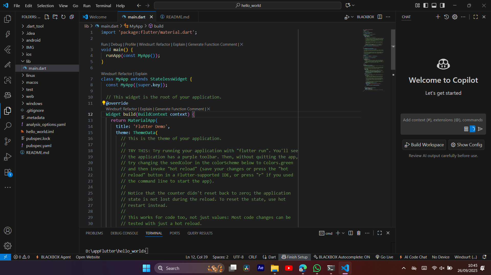
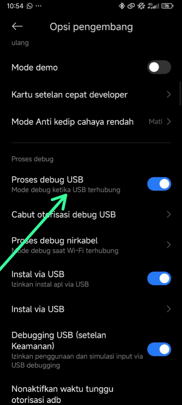

 # Practical 1: Creating a New Flutter Project

Succesfuly create flutter project with name hello_world project

# Practical 2: Connecting an Android Device or Emulator

1.  Enable USB debugging

2. Run your app on the Android device with a cable

# Practical 3: Creating a GitHub Repository and Practical Report

1. 

   

