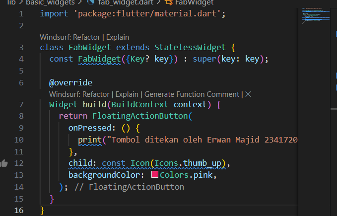

 # Practical 1: Creating a New Flutter Project

Succesfuly create flutter project with name hello_world project

# Practical 2: Connecting an Android Device or Emulator

1.  Enable USB debugging

2. Run your app on the Android device with a cable

# Practical 3: Creating a GitHub Repository and Practical Report

1. Add Project to Github

2. Run hello_world project on browser

# Lab 4: Implementing Basic Widgets

1. Text Widget

Step : 

Result:

MyTextWidget class is a StatelessWidget that shows a red, centered text message. In the main widget (not fully shown but implied from _counter and _incrementCounter), a Column arranges two children vertically: the custom MyTextWidget and a Text widget displaying the current value of _counter. A FloatingActionButton with a plus icon calls _incrementCounter each time it’s pressed, increasing the counter value and updating the display automatically because the parent widget is a StatefulWidget.MyTextWidget is stateless and its properties never change, Flutter can safely reuse the same widget without creating new objects, which reduces memory usage and speeds up rendering. If you remove const, Flutter will rebuild a new instance of MyTextWidget each time the widget tree refreshes, even though nothing inside it changes.

2. Image Widget

Result: 

This code works by loading and displaying an image from the project’s assets folder. The image file logo-polinema.png is registered in the pubspec.yaml, which allows Flutter to access it inside the app. The MyImageWidget class, defined as a StatelessWidget, builds and returns an Image widget that uses AssetImage("assets/logo-polinema.png") to fetch the file. In the main layout, a Column widget is used with its children centered vertically. Inside this column, the MyImageWidget displays the logo above a Text widget that shows the counter value. The floating action button at the bottom increases the counter each time it is pressed, updating the number on screen, while the image remains fixed in place above it

# Practical 5: Implementing Material Design Widgets and iOS Cupertino

Step 1: Cupertino Button and Loading Bar

Result : 

This code defines a LoadingCupertino widget that builds a simple UI using Flutter’s iOS-style components. It wraps the layout in a MaterialApp, then displays a white container with a vertical column containing a CupertinoButton and a CupertinoActivityIndicator (spinner). When LoadingCupertino is placed inside another widget with mainAxisAlignment: MainAxisAlignment.center, the whole button and spinner are centered within the parent layout

Step 2: Floating Action Button (FAB)

Result : 

The FabWidget is a custom stateless widget that wraps Flutter’s FloatingActionButton. It accepts an onPressed parameter of type VoidCallback, which allows the parent widget to define what action should occur when the button is pressed. Inside, it builds a floating button with a pink background and a thumbs-up icon. This design makes the widget reusable and flexible because the button’s appearance is fixed, but the action it performs can be customized by different parent widgets, supporting cleaner and modular code structure

Step 3: Scaffold Widget

Result : 

The code demonstrates the use of the Scaffold widget, which provides a basic layout structure for a Flutter application. The Scaffold includes an AppBar at the top to display the title "Scaffold Example", giving the application a clear header section. The main content is placed in the body of the scaffold, where a Text widget is centered on the screen and styled using the headlineLarge property from the app’s theme. This ensures that the text appearance is consistent with the overall Material Design style. By combining the AppBar and a central text widget, the code illustrates how the Scaffold serves as the foundation for creating clean and organized user interfaces in Flutter.

Step 4: Widget Dialog

Result : 

This Flutter code works by displaying a single button on the screen. When the user taps the button, it calls the showAlertDialog function, which creates and shows an AlertDialog with a title, a message, and an OK button. The dialog appears on top of the current screen, and the app waits for the user to interact with it. Pressing the OK button triggers Navigator.pop(context), which closes the dialog and returns the user to the main screen. Essentially, the code demonstrates how to trigger and display a popup alert dialog in Flutter and handle user interaction to dismiss it.

Step 5: Input and Selection Widget

Result : 

When run, a page will appear with an AppBar and a TextField.
This TextField is ready to accept text input from the user, for example, typing a name.
The input box displays a border and the label "Name."

Step 6: Date and Time Pickers

Result : 

This Flutter code creates a simple Date Picker app. It displays the current date on the screen and lets the user select a new date using a built-in calendar popup (showDatePicker). When the user picks a date, the app updates the displayed date on the screen. The button triggers the date picker, and the selected date is stored in a state variable (selectedDate) so the UI automatically refreshes. Essentially, it demonstrates how to take user input for dates and update the app interface dynamically.

   

